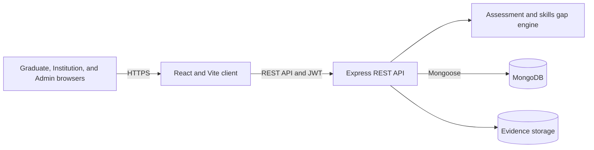
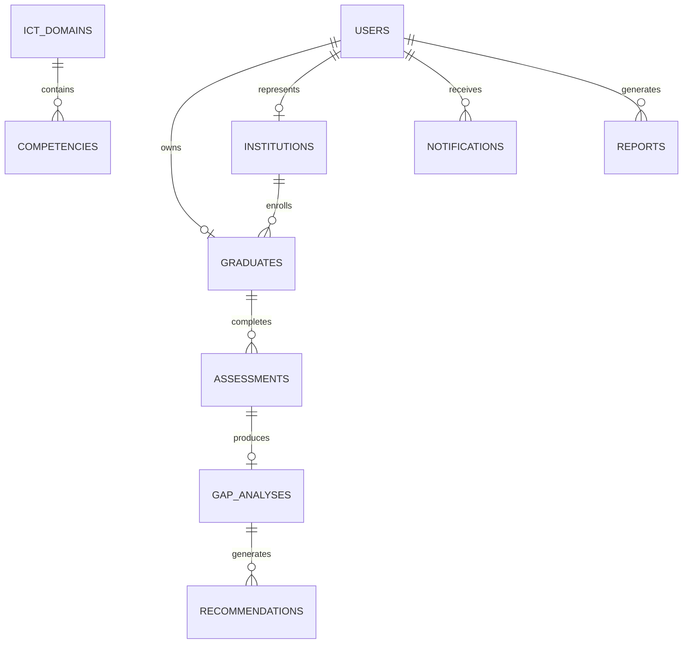
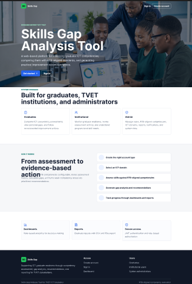
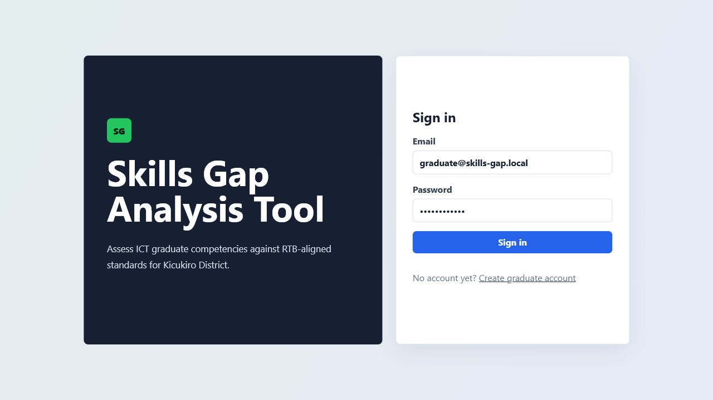
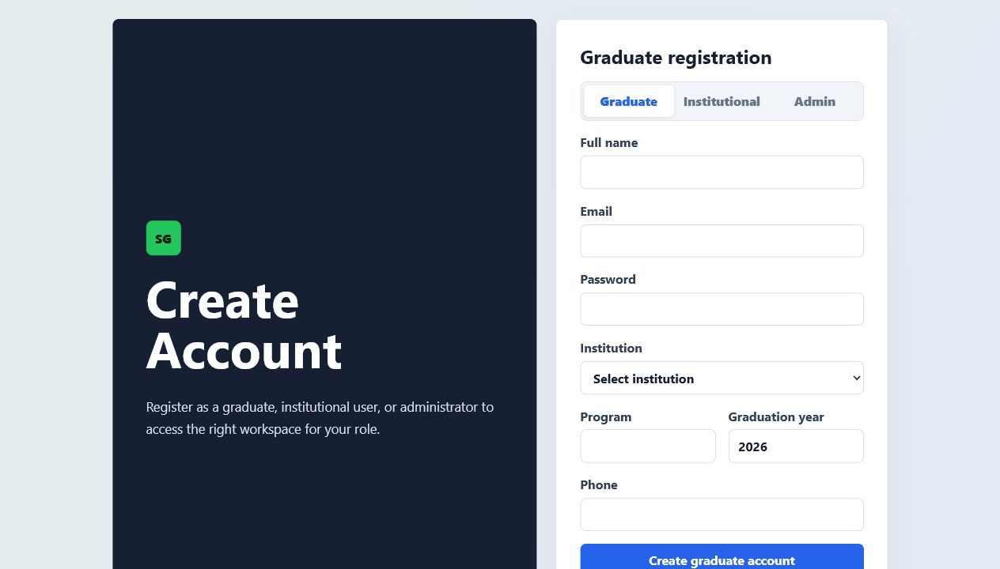
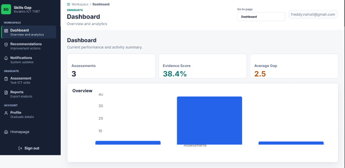
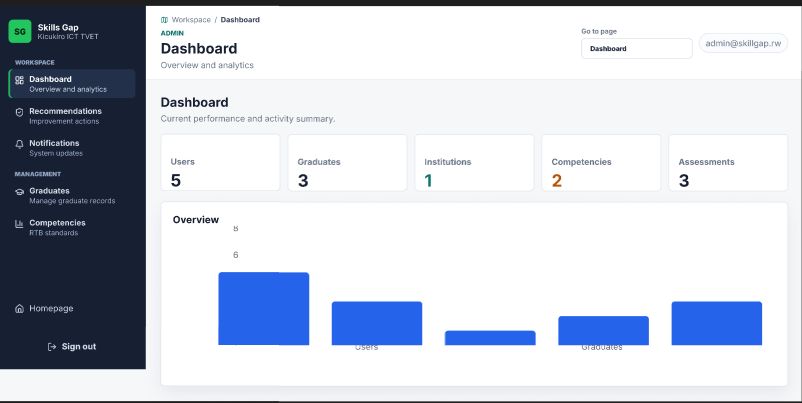

# Skills Gap Analysis Tool

## Description

The Skills Gap Analysis Tool identifies differences between the ICT competencies held by TVET
graduates in Kicukiro District and RTB-aligned competency standards.

The application supports:

- **Graduates:** complete assessments, submit evidence, view gap analyses, export reports, and
  follow recommendations.
- **Institutions:** monitor graduates, review assessments, inspect reports, and configure
  recommendation rules.
- **Administrators:** manage users, institutions, ICT domains, competency standards, and the
  private assessment question bank.

Repository: [github.com/fniyonshuti/Skillgap-project](https://github.com/fniyonshuti/Skillgap-project)

## Technology

- Client: React 18, Vite, React Router, Axios, Recharts, and Lucide React
- Server: Node.js 20+, Express, JWT, PDFKit, and Multer
- Database: MongoDB with Mongoose
- Testing: Node.js test runner
- Planned hosting: Vercel, Render, and MongoDB Atlas

## Project Structure

The repository has only two application directories at its root:

```text
.
|-- client/                    React and Vite browser application
|   |-- scripts/               Client quality checks
|   |-- src/
|   |   |-- app/               Providers and route composition
|   |   |-- assets/            Application and README images
|   |   |-- components/        Shared UI components
|   |   |-- config/            Navigation and static configuration
|   |   |-- context/           Cross-application React state
|   |   |-- features/          Feature modules and pure helpers
|   |   |-- pages/             Route-level screens
|   |   |-- services/          API clients
|   |   |-- styles/            Global styles
|   |   `-- utils/             Browser utilities
|   `-- test/                  Client unit tests
`-- server/                    Node.js and Express API
    |-- scripts/               Quality and integration scripts
    |-- src/
    |   |-- config/            Environment, database, and security configuration
    |   |-- controllers/       HTTP request and response adapters
    |   |-- middlewares/       Authentication, uploads, and error handling
    |   |-- models/            Mongoose schemas
    |   |-- routes/            Endpoint modules and route registry
    |   |-- serializers/       Public API response shapes
    |   |-- services/          Business rules and workflow orchestration
    |   |-- validators/        Request validation contracts
    |   `-- utils/             Framework-independent helpers
    `-- test/                  Server tests
```

The server request flow is:

```text
route -> validator/middleware -> controller -> service -> model
```

Controllers remain thin. Business workflows and access rules belong in services, persistence
invariants belong in models, and external response shapes belong in serializers.

## Architecture



### Core Data Relationships



## Assessment Method

Graduates submit answer and evidence references, never numeric scores. The server resolves private
question points and calculates:

```text
Weighted score =
  (Practical x 40%)
  + (Portfolio x 30%)
  + (Academic x 20%)
  + (Self-assessment x 10%)
```

| Weighted score | Level | Interpretation |
| --- | --- | --- |
| 80-100 | 4 | Highly Competent |
| 60-79 | 3 | Competent |
| 40-59 | 2 | Partially Competent |
| 0-39 | 1 | Not Yet Competent |

```text
Gap score = required RTB level - achieved graduate level
```

| Gap score | Classification | Recommendation priority |
| --- | --- | --- |
| `<= 0` | No Gap | None |
| `1` | Low Gap | Low |
| `2` | Moderate Gap | Medium |
| `>= 3` | High Gap | High |

Assessment processing validates every answer and evidence reference, calculates source scores,
maps RTB levels, generates the gap analysis, creates institution-owned recommendations, saves a
report, and creates a notification.

## Local Setup

### Prerequisites

- Node.js `20` to `24`
- npm
- Git
- MongoDB Community Server or MongoDB Atlas

### Installation

```bash
git clone https://github.com/fniyonshuti/Skillgap-project.git
cd Skillgap-project
npm ci
```

The root install command installs root, client, and server dependencies.

### Environment Files

The project uses exactly two local runtime files:

- `server/.env`
- `client/.env`

Both files and all `.env` variants are ignored by Git. Do not commit environment files, database
credentials, JWT secrets, setup codes, seed passwords, API keys, or access tokens.

Create the local files:

```powershell
New-Item server/.env -ItemType File -Force
New-Item client/.env -ItemType File -Force
```

Configure these server variables locally:

| Variable | Purpose | Required |
| --- | --- | --- |
| `NODE_ENV` | Runtime mode | Yes |
| `PORT` | API port | Yes |
| `MONGO_URI` | MongoDB connection string | Yes |
| `JWT_SECRET` | JWT signing secret; use at least 32 random characters | Yes |
| `JWT_EXPIRES_IN` | Access-token lifetime | Yes |
| `CLIENT_URL` or `CLIENT_URLS` | Exact allowed frontend origin or origins | Yes |
| `ADMIN_REGISTRATION_CODE` | Private administrator registration code | Optional |
| `SEED_DEFAULT_PASSWORD` | Local-only password used by the seed command | Required for seeding |

Configure the client:

```env
VITE_API_URL=/api
```

Anything prefixed with `VITE_` is bundled into browser code and must never contain a secret.

Generate secrets locally with a cryptographically secure password manager or random-value
generator. Production values belong in the hosting provider's secret manager, not in this
repository.

### Database

For local MongoDB, start the MongoDB service before the API. For Atlas:

1. Create a cluster and least-privilege database user.
2. Restrict network access to expected addresses.
3. Store the connection string only in `server/.env` or the deployment secret manager.
4. Enable backups and test restoration.

### Seed and Run

The seed operation clears the configured database. Use it only against a development database:

```bash
npm run seed
npm run dev
```

- Client: `http://localhost:5173`
- API: `http://localhost:5000/api`
- Health check: `http://localhost:5000/health`

The seed script creates local development accounts but never prints or stores their password in
tracked source. Use the local `SEED_DEFAULT_PASSWORD` value to sign in.

For an existing database created before system-scored question banks:

```bash
npm run migrate:question-banks
```

## Quality Commands

```bash
npm run lint
npm test
npm run build
npm run check
```

`npm run check` runs client/server source checks, all tests, and the production client build.

## API Overview

Base URL: `/api`

| Area | Endpoints |
| --- | --- |
| Authentication | `POST /auth/register`, `POST /auth/login`, `GET /auth/me` |
| Analytics | `GET /analytics/dashboard` |
| Institutions | `GET/POST /institutions`, `PATCH/DELETE /institutions/:id` |
| Domains | `GET/POST /domains`, `PATCH /domains/:id` |
| Competencies | `GET/POST /competencies`, `PATCH/DELETE /competencies/:id` |
| Question banks | `GET /competencies/assessment`, `GET /competencies/manage` |
| Graduates | `GET/PATCH /graduates/me`, `GET /graduates`, `GET /graduates/:id` |
| Assessments | `GET/POST /assessments`, `GET /assessments/:id`, `PATCH /assessments/:id/review` |
| Gap analyses | `GET /gaps/graduate/:graduateId/latest`, `GET /gaps/assessment/:assessmentId` |
| Evidence | `POST /evidence/upload`, `GET /evidence/:id/download`, `DELETE /evidence/:id` |
| Recommendations | `GET /recommendations`, `PATCH /recommendations/:id/status` |
| Institution rules | `GET/PUT /recommendation-rules` |
| Reports | `GET /reports/graduate/:graduateId` with optional `json`, `csv`, or `pdf` format |
| Notifications | `GET /notifications`, `PATCH /notifications/:id/read` |

Evidence uploads accept PDF, Word, PNG, JPEG, and WebP files up to 5 MB. Access is restricted by
role and graduate ownership.

## Designs

 Figma design file: https://www.figma.com/design/vsjbkJEG4SrwFaQK9jBG5B/Skill-gap-Analyse-tool?node-id=5-444&t=ckeEWIlck0lA0Ung-1 
### Home



### Login



### Registration



### Graduate Dashboard


### Administrator Dashboard


This is a software-only system, so an electrical circuit diagram is not applicable. The architecture
and data diagrams above are the software equivalents.

## demo video

https://docs.google.com/document/d/1MisCnUkSxGNXajSXpc9D6KD7Fb9dTgcopG_WuA1Ck78/edit?usp=sharing

## Security

Implemented controls include:

- Explicit CORS origins with no preview-domain wildcard
- JWT algorithm restrictions and production secret validation
- API and authentication rate limits
- Route validation and Mongoose schema constraints
- Centralized role-to-resource authorization
- Public response serializers that exclude private fields
- Escaped search expressions and bounded pagination
- Evidence extension, MIME type, signature, ownership, and size validation
- Request identifiers and production-safe error responses
- Git-ignored environment files, uploads, reports, logs, builds, and dependencies

Current deployment boundaries:

- Evidence files use local server storage. Use durable attached storage for one instance, or replace
  it with managed object storage and malware scanning before horizontal scaling.
- Browser access tokens currently use `localStorage`. A future authentication migration should use
  short-lived access tokens and secure HTTP-only refresh cookies with CSRF protection.

Before publishing:

1. Run `npm run check`.
2. Confirm no `.env` file is staged.
3. Scan staged changes for credentials, private URLs, tokens, and personal data.
4. Rotate any credential that may have been exposed.
5. Verify MongoDB network restrictions, backups, evidence storage, CORS, and role authorization.

## Deployment Plan

1. Provision MongoDB Atlas with restricted networking, least-privilege credentials, and backups.
2. Deploy the Express API to Render or an equivalent Node.js platform.
3. Configure server secrets only in the platform secret manager.
4. Deploy the `client` directory to Vercel.
5. Proxy frontend `/api/*` requests to the deployed backend through the root `vercel.json`.
6. Restrict `CLIENT_URLS` to the exact production frontend origins.
7. Run smoke tests for registration, login, assessment, evidence, reports, authorization, and
   `/health`.
8. Monitor request IDs, error rates, database usage, storage capacity, and backup restoration.

### Backend

```text
Build Command: npm ci
Start Command: npm start
Health Check Path: /health
```

### Frontend

```text
Framework: Vite
Root Directory: repository root
Build Command: npm run build --prefix client
Output Directory: client/dist
Install Command: npm ci --prefix client
```

## Development Rules

- Keep pages and controllers focused on orchestration.
- Put reusable business rules in feature or service modules.
- Validate every external input at the route boundary.
- Add tests for changed behavior.
- Use `PascalCase.jsx` for React components and `camelCase.js` for JavaScript modules.
- Never expose scoring points to graduate APIs or accept graduate-provided numeric scores.
- Never commit secrets, generated builds, uploaded evidence, reports, or environment files.
