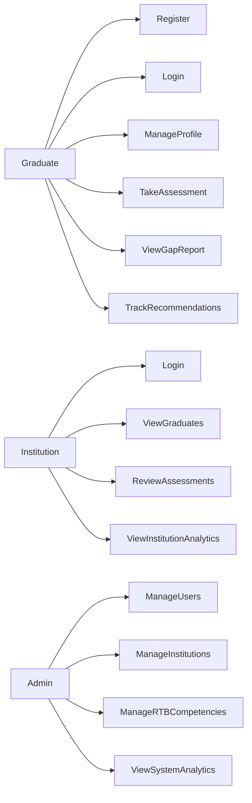
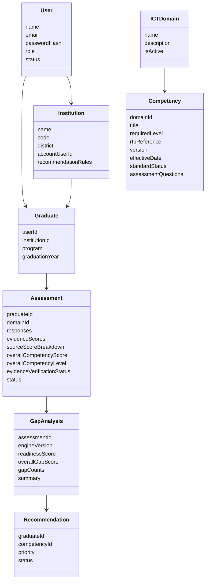
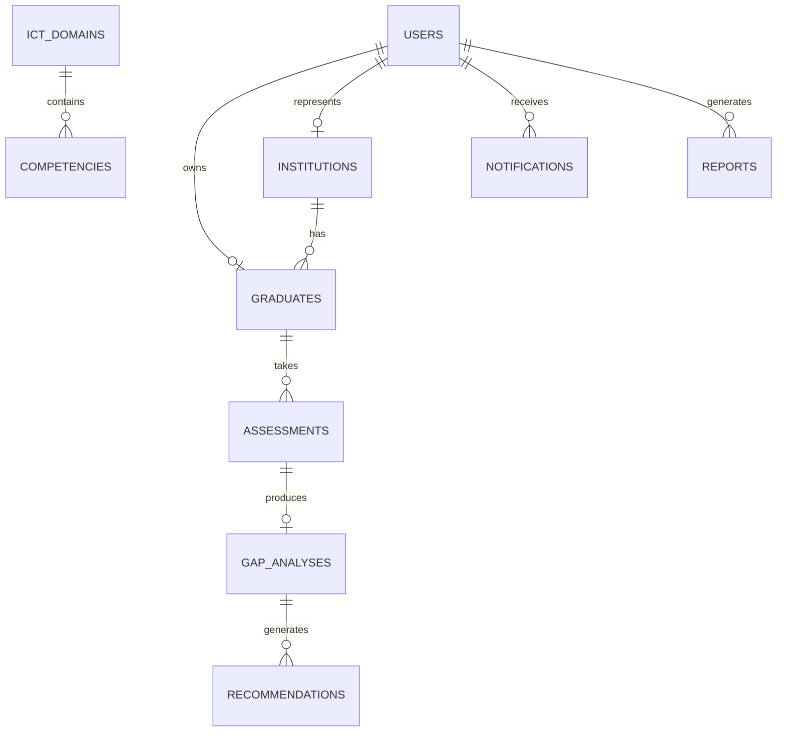
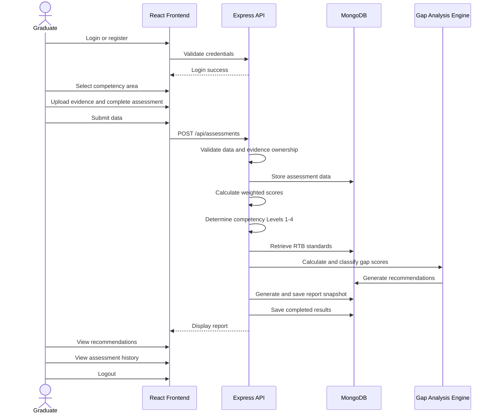

# Project Blueprint

## Project

**Skills Gap Analysis Tool for TVET ICT Graduates in Kicukiro District**

The system identifies the gap between ICT skills possessed by TVET graduates and RTB-aligned ICT competency standards. It supports graduate self-assessment, institution review, gap analysis, recommendations, dashboards, notifications, and report generation.

## Implementation Assumptions

- RTB competency requirements use Levels `1` to `4`.
- Graduate competency results are calculated from practical assessment, portfolio, academic record, and self-assessment evidence.
- RTB competencies are versioned, stored in MongoDB, and managed by administrators.
- Low, medium, and high recommendation rules are defined only by each institution.
- Graduate evidence is submitted first, then an institution or administrator can mark it as reviewed.
- Reports support JSON preview, CSV export, and PDF export.
- Starter domains are Software Development, Networking, Database Administration, Cybersecurity, and ICT Support.

## Core Assessment Methodology

The system implements the scoring model specified in the capstone proposal:

```text
Weighted competency score =
  (Practical assessment x 40%)
  + (Portfolio evidence x 30%)
  + (Academic record x 20%)
  + (Self-assessment x 10%)
```

The server calculates the result and maps it to an RTB competency level:

| Weighted score | Competency level | Interpretation |
| --- | --- | --- |
| 80-100 | Level 4 | Highly Competent |
| 60-79 | Level 3 | Competent |
| 40-59 | Level 2 | Partially Competent |
| 0-39 | Level 1 | Not Yet Competent |

The competency gap is calculated as:

```text
Gap score = RTB required level - graduate achieved level
```

| Gap score | Classification | Rule priority |
| --- | --- | --- |
| <= 0 | No Gap | None |
| 1 | Low Gap | Low |
| 2 | Moderate Gap | Medium |
| >= 3 | High Gap | High |

All calculations are performed by the backend. The graduate frontend receives question prompts and
answer labels, but never receives option points and never submits numeric scores. The raw gap is
retained, so a negative value shows that the graduate exceeds the required RTB level.

## Skills Gap Analysis Engine

```text
START
Receive graduate answer option IDs and supporting evidence
Validate every active RTB question is answered exactly once
Resolve private option points from the administrator-managed question bank
Average question points into practical, portfolio, academic, and self-assessment source scores
Calculate weighted competency score: P(0.40) + PF(0.30) + A(0.20) + S(0.10)
Determine graduate Level 1-4 and competency status
Retrieve the required RTB level from the competency standards database
Calculate Gap Score = Required RTB Level - Graduate Level
Classify the gap and select the matching institution-defined recommendation rule
Generate the competency report
Save the report in MongoDB
Display the report to the graduate and authorized administrator/institution
END
```

Missing, duplicate, or foreign answer IDs stop processing with `Invalid assessment responses`.
Any graduate request containing `evidenceScores` is rejected because scores are server-generated.

## Architecture

```text
React Client
  |
  | REST API, JWT
  |
Express API
  |
  | Mongoose
  |
MongoDB
```

## Backend Modules

- Auth and role-based access control
- Graduate profile management
- Institution management
- Institution-owned recommendation rule management
- ICT domain and RTB competency management
- Assessment submission
- Evidence score calculation and competency mapping
- Gap analysis engine
- Recommendation generation
- Reports
- Notifications
- Dashboard analytics

## Database Design

The implementation uses MongoDB collections with embedded subdocuments where data is naturally owned by one parent:

- Assessment items are embedded inside assessments.
- Gap items are embedded inside gap analyses.
- Recommendation rules are embedded inside the institution that owns them.
- Recommendations remain separate documents because they have status tracking over time.

### Collections

```text
users
institutions
graduates
ictdomains
competencies
assessments
gapanalyses
recommendations
evidences
notifications
reports
```

## Use Case Diagram

For the complete proposal-ready UML set, see
[UML_DIAGRAMS.md](UML_DIAGRAMS.md). The diagrams below are retained as compact summaries.



## Class Diagram



## ERD



## Assessment Sequence



## Graduate Workflow Framework

```text
GRADUATE                         SYSTEM
Login/Register ----------------> Validate credentials
             <------------------ Login success
Select competency area
Upload evidence
Complete assessment
Submit data --------------------> Validate data
                                  Store data
                                  Calculate score
                                  Determine level
                                  Retrieve RTB standards
                                  Calculate gap score
                                  Classify gap
                                  Generate recommendations
                                  Generate report
                                  Save results
             <------------------ Display report
View recommendations
View assessment history
Logout
```

The implementation stores this processing sequence in the assessment `workflowLog`. Reports are
generated automatically when an assessment is submitted, rather than only when the Reports page is
opened.

## Core Workflow Success Responses

- RTB standard create: `RTB competency standard added successfully.`
- RTB standard update: `RTB competency standard updated successfully.`
- Competency mapping: `Competencies mapped successfully.`
- Gap analysis: `Skills gap analysis completed.`
- Gap scoring: `Gap score generated successfully.`
- Recommendation generation: `Recommendations generated.`
- Report generation: `Competency report generated successfully.`

## Development Roadmap

1. Project setup and documentation
2. Authentication and role-based access
3. Core data management
4. Assessment workflow
5. Gap analysis and recommendations
6. Dashboards and reports
7. Notifications
8. QA, security review, and deployment

## Quality Notes

- Passwords are hashed with bcrypt.
- JWT is required for protected routes.
- Role checks protect graduate, institution, and admin features.
- Inputs are validated server-side.
- Assessment calculations are server-authoritative and unit tested.
- Every assessment stores an RTB reference/version snapshot for auditability.
- Submitted evidence is clearly distinguished from institution-reviewed evidence.
- MongoDB indexes support common lookup patterns.
- Business rules live in services instead of controllers.
