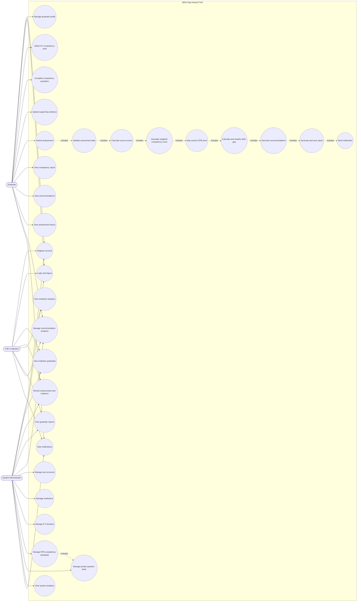
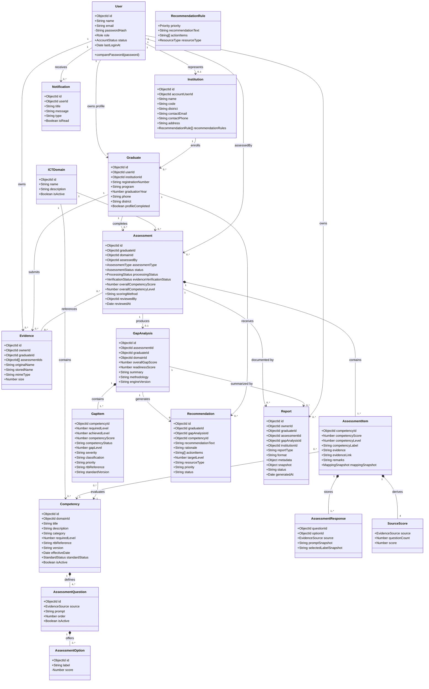
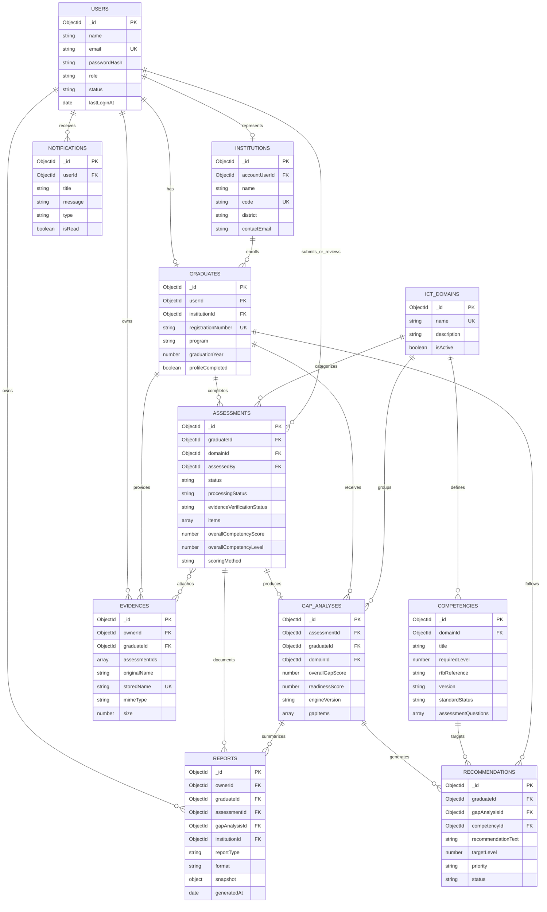
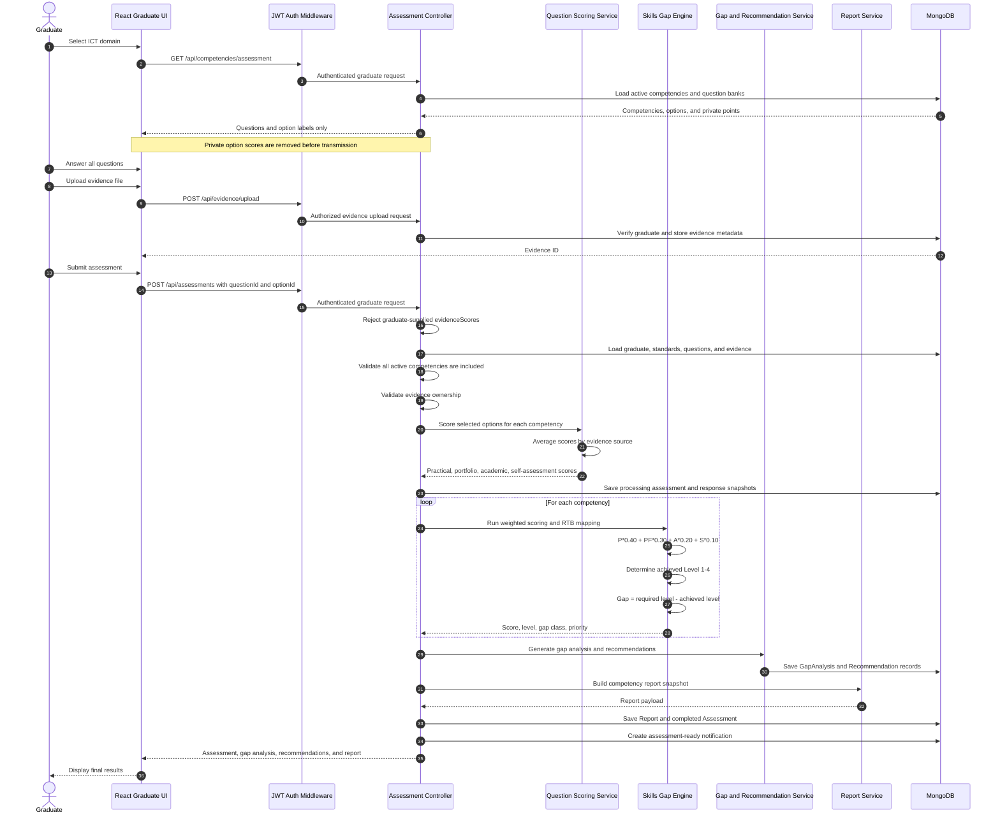
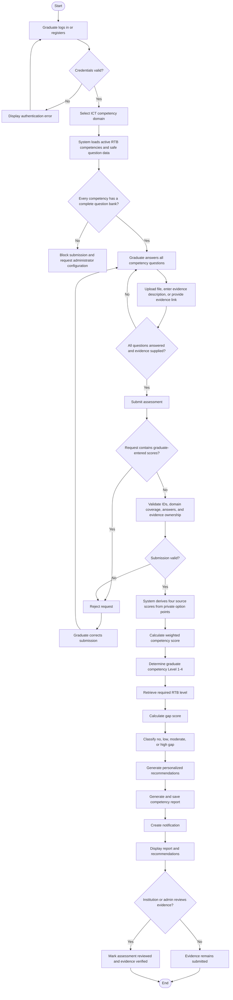
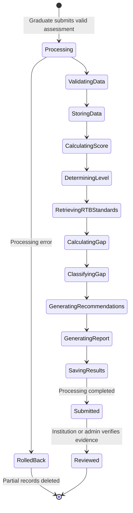
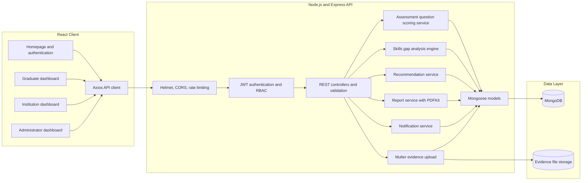
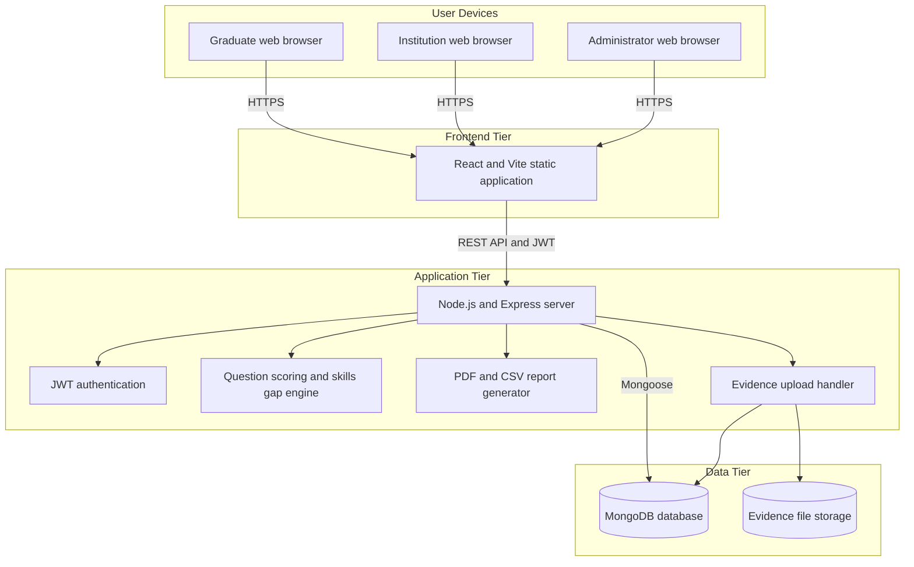

# UML Diagrams

## Skills Gap Analysis Tool for TVET ICT Graduates in Kicukiro District

These diagrams reflect the implemented React, Express, MongoDB, JWT, question-bank scoring,
evidence, gap-analysis, recommendation, report, notification, and review workflows.

> Proposal note: The current system stores RTB-aligned competency standards entered and maintained
> by an administrator. It does not currently integrate with an external RTB API. The competency
> wording and reference codes used in the final deployment should be validated with official RTB
> documents or an authorized RTB representative.

## 1. Use Case Diagram

### Use-case interpretation

- Graduates never enter numeric marks. They answer questions and submit evidence.
- Administrators define competency requirements, questions, answer options, and private points.
- Institutions review evidence for graduates belonging to their institution.
- Assessment submission automatically invokes scoring, mapping, gap analysis, recommendations,
  reporting, and notification.

## 2. Domain Class Diagram

## 3. Entity Relationship Diagram

## 4. Graduate Assessment Sequence Diagram

## 5. Assessment Activity Diagram

## 6. Assessment State Diagram

## 7. Component Diagram

## 8. Deployment Diagram

## 9. Architecture Decisions Represented

1. **Three roles:** `graduate`, `institution`, and `admin` are enforced through JWT and role-based
   authorization.
2. **Server-authoritative scoring:** graduates submit answer IDs, not numeric scores.
3. **Protected scoring key:** question option points remain on the server and are not exposed through
   graduate, report, recommendation, or gap-analysis APIs.
4. **Weighted method:** practical `40%`, portfolio `30%`, academic `20%`, and self-assessment `10%`.
5. **Auditable standards:** every assessment item stores an RTB reference, title, required level, and
   standard-version snapshot.
6. **Institution review:** generated results can be reviewed and evidence marked as verified.
7. **Persistent outputs:** assessments, gap analyses, recommendations, reports, evidence metadata,
   workflow logs, and notifications are stored in MongoDB.
8. **No external RTB integration yet:** standards are manually managed in the administrator panel.
